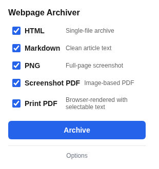

<p align="center">
  
</p>

# Webpage Archiver

<!-- BADGES:START -->

[](LICENSE.md)
[](CONTRIBUTING.md)
<!-- BADGES:END -->

## Table of Contents

- [Description](#description)
- [Screenshots](#screenshots)
- [Features](#features)
- [Requirements](#requirements)
- [Installation](#installation)
- [Usage](#usage)
  - [Archiving a page](#archiving-a-page)
  - [Keyboard shortcut](#keyboard-shortcut)
  - [File names](#file-names)
  - [Markdown output](#markdown-output)
- [Configuration](#configuration)
- [Permissions](#permissions)
- [Limitations](#limitations)
- [Architecture](#architecture)
- [Credits](#credits)
- [Contributing](#contributing)
- [License](#license)

## Description

A Manifest V3 Chrome extension that saves the page you are looking at in up to
five formats with one click: a self-contained HTML file, clean Markdown, a
full-page PNG, a screenshot PDF and a print PDF with selectable text. By default
the files arrive as one ZIP in your Downloads folder.

Everything happens inside your browser. Nothing is sent to a server.

## Screenshots

<p align="center">
  
</p>

<p align="center"><em>The popup: pick any combination of the five output formats, then Archive.</em></p>

## Features

| Format | What it captures | How |
|---|---|---|
| **HTML** | The whole page as one self-contained file, with stylesheets and images inlined and scripts removed | A custom serializer over the live DOM |
| **Markdown** | Just the article text, with YAML front matter | [Readability](https://github.com/mozilla/readability) + [Turndown](https://github.com/mixmark-io/turndown) |
| **PNG** | A full-page screenshot, exactly as the browser rendered it | Scrolls the page, captures each screen and stitches them together |
| **Screenshot PDF** | The full-page screenshot, split across A4 pages | [jsPDF](https://github.com/parallax/jsPDF) |
| **Print PDF** | The page as Chrome prints it, with selectable text | Chrome's own `Page.printToPDF` |

- **One click, any combination** of the five formats
- **One ZIP or separate files**, your choice
- **A configurable file name** built from the date, site, page title and a
  timestamp
- **A keyboard shortcut** that archives with your saved default formats
- **Markdown that falls back gracefully**: when a page has no recognisable
  article, the whole body is converted instead
- **Local only**: no account, no server, no tracking

## Requirements

- **Google Chrome 109** or newer, or another Chromium-based browser (Edge,
  Brave, Arc) that supports Manifest V3 offscreen documents
- **Developer mode** turned on at `chrome://extensions`, to load the extension
  unpacked
- **Node.js 20+** and npm, only if you want to update the bundled libraries or
  run the tests. The built libraries are already in `vendor/`.

## Installation

```bash
git clone https://github.com/geoffmyers/webpage-archiver.git
```

Then load it into Chrome:

1. Open `chrome://extensions`.
2. Turn on **Developer mode** (top right).
3. Click **Load unpacked** and choose the `webpage-archiver` folder.
4. Pin **Webpage Archiver** to the toolbar from the extensions menu.

To rebuild the bundled libraries after changing a dependency:

```bash
cd webpage-archiver
npm install
npm run build        # copies the libraries from node_modules into vendor/
```

## Usage

### Archiving a page

1. Open the page you want to keep.
2. Click the Webpage Archiver icon in the toolbar.
3. Tick the formats you want: **HTML**, **Markdown**, **PNG**, **Screenshot PDF**
   and **Print PDF** are all on by default.
4. Click **Archive**. A progress bar shows each step, then a list of what was
   saved.

The PNG and screenshot PDF are made by scrolling the page, so leave the tab in
front until the progress bar finishes.

### Keyboard shortcut

**Ctrl+Shift+S** (**⌘+Shift+S** on macOS) archives the current tab with the
formats saved in the options. Change the key at `chrome://extensions/shortcuts`.

### File names

The default pattern is `{date}_{hostname}_{title}`. Spaces become hyphens,
characters that are not allowed in file names are removed, and names are cut to
120 characters. For a page titled "Article Title" on `www.example.com`:

```
2026-02-17_example.com_Article-Title.zip        ← default: one ZIP containing
    2026-02-17_example.com_Article-Title.html
    2026-02-17_example.com_Article-Title.md
    2026-02-17_example.com_Article-Title.png
    2026-02-17_example.com_Article-Title.screenshot.pdf
    2026-02-17_example.com_Article-Title.print.pdf
```

When only one of the two PDF formats is selected, its file is just `.pdf`.
`{date}` is the UTC date, and a leading `www.` is dropped from `{hostname}`.

### Markdown output

The Markdown format keeps only the main article, without navigation, ads,
sidebars or footers, and starts with front matter. Fields the page does not
provide are left out.

```markdown
---
title: "Article Title"
url: "https://example.com/article"
archived: "2026-02-17T00:00:00.000Z"
author: "Author Name"
excerpt: "A brief summary..."
siteName: "Example.com"
---

Clean article content here...
```

## Configuration

Open the options from the **Options** link in the popup, or from
`chrome://extensions` → Webpage Archiver → Details → Extension options.

| Setting | Default | What it does |
|---|---|---|
| Default formats | All five | Which formats are ticked when the popup opens, and which the shortcut uses |
| Filename pattern | `{date}_{hostname}_{title}` | Tokens: `{date}`, `{hostname}`, `{title}`, `{timestamp}` (milliseconds since 1970) |
| Subfolder | *(none)* | Saves into a folder inside Downloads |
| Bundle all formats into a single ZIP file | On | Off saves each format as a separate download |

Settings are stored with `chrome.storage.sync`, so they follow your Chrome
profile.

## Permissions

| Permission | Why |
|---|---|
| `activeTab`, `<all_urls>` | Read the page you asked to archive |
| `scripting` | Run the capture script in that page |
| `downloads` | Save the files |
| `storage` | Remember your settings |
| `offscreen` | Stitch screenshots, build the PDF and pack the ZIP; a Manifest V3 service worker has no DOM to do it in |
| `debugger` | Produce the print PDF through Chrome's `Page.printToPDF`. Chrome shows a "started debugging this browser" bar while it runs |

## Limitations

- **Pages without a clear article** (dashboards, single-page apps, social
  feeds) give Readability nothing to extract, so the Markdown falls back to the
  whole page body and is noisier.
- **Cross-origin images** cannot be inlined into the HTML archive because the
  browser blocks reading them. They keep their original URLs.
- **Very long pages** are cut off at 32,000 pixels in the PNG and screenshot
  PDF.
- **Restricted pages** such as `chrome://` pages and the Chrome Web Store cannot
  be captured, because Chrome does not let extensions run scripts there.

## Architecture

```
popup.js ──► service-worker.js ──► content-script.js (in the page)
                   │                   HTML serialisation, Readability, Turndown
                   │
                   ├──► captureVisibleTab, screen by screen ──► offscreen.js
                   │                                             stitch PNG, jsPDF, JSZip
                   ├──► chrome.debugger: Page.printToPDF
                   └──► chrome.downloads
```

| Path | Role |
|---|---|
| `manifest.json` | Permissions, service worker, popup, options page and shortcut |
| `src/popup/` | Format picker, progress and results |
| `src/background/service-worker.js` | Orchestrates a capture: injects the content script, scrolls and screenshots, builds file names, downloads |
| `src/content/content-script.js` | Runs in the page: HTML and Markdown capture |
| `src/offscreen/` | DOM work the service worker cannot do: stitching, PDF and ZIP |
| `src/options/` | Settings page |
| `vendor/` | Bundled third-party libraries, committed so the extension loads with no build step |
| `build.js` | Copies those libraries out of `node_modules` |
| `tests/` | Playwright tests |

See [ARCHITECTURE.md](ARCHITECTURE.md) for more detail.

## Credits

| Library | License | Used for |
|---|---|---|
| [@mozilla/readability](https://github.com/mozilla/readability) | Apache-2.0 | Finding the article in a page |
| [Turndown](https://github.com/mixmark-io/turndown) and [turndown-plugin-gfm](https://github.com/mixmark-io/turndown-plugin-gfm) | MIT | HTML to Markdown, including tables |
| [jsPDF](https://github.com/parallax/jsPDF) | MIT | The screenshot PDF |
| [JSZip](https://stuk.github.io/jszip/) | MIT or GPL-3.0 | The ZIP bundle |
| [html2canvas](https://html2canvas.hertzen.com/) | MIT | Still bundled in `vendor/`, but no longer used: screenshots now come from the browser itself |
| [Playwright](https://playwright.dev/) | Apache-2.0 | Tests |

The icon, in the extension and here, is the [Font Awesome](https://fontawesome.com/)
`box-archive` glyph, used under [CC BY 4.0](https://creativecommons.org/licenses/by/4.0/).

Chrome is a trademark of Google LLC. This extension is not affiliated with or
endorsed by Google.

Written by Geoff Myers.

## Contributing

Bug reports and pull requests are welcome. See [CONTRIBUTING.md](CONTRIBUTING.md)
for setup, checks and how this repository is published.

## License

This program is free software: you can redistribute it and/or modify it under
the terms of the GNU General Public License as published by the Free Software
Foundation, either version 3 of the License, or (at your option) any later
version.

This program is distributed in the hope that it will be useful, but WITHOUT ANY
WARRANTY; without even the implied warranty of MERCHANTABILITY or FITNESS FOR A
PARTICULAR PURPOSE. See [LICENSE.md](LICENSE.md) for the full text of the GNU
General Public License.

SPDX-License-Identifier: `GPL-3.0-or-later`
